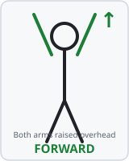
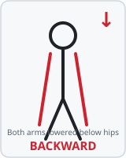
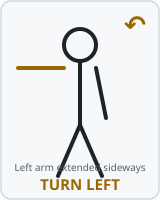
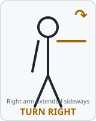
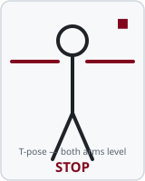

# 🤖 nano-explorer
[](https://github.com/ahestevenz/nano-explorer/actions/workflows/tests.yml)
[](https://github.com/ahestevenz/nano-explorer/actions/workflows/lint.yml)
[](https://www.python.org/downloads/release/python-360/)
[](https://developer.nvidia.com/embedded/jetpack)
[](https://developer.nvidia.com/embedded/jetson-nano)
[](LICENSE)

A modular command-line toolkit for the **Waveshare JetBot** powered by the **NVIDIA Jetson Nano 4GB (Maxwell, B01)**.

Covers basic motion, computer vision, navigation and ML experiments — all driven from a single CLI entry point.

---

## Platform

| Component   | Version                          |
|-------------|----------------------------------|
| JetPack     | 4.6.1 (L4T 32.7.1)              |
| OS          | Ubuntu 18.04 aarch64             |
| Python      | 3.6                              |
| CUDA        | 10.2                             |
| cuDNN       | 8.2                              |
| TensorRT    | 8.2                              |
| OpenCV      | 4.1.1 (JetPack bundled)          |
| PyTorch     | 1.10.0 (Jetson wheel)            |
| TorchVision | 0.11.0                           |

> ⚠️ PyTorch ≥ 1.11 requires Python ≥ 3.7 and is **not** compatible with JetPack 4.6.x on the Nano.


## Installation

See [doc/jetbot-setup.md](doc/jetbot-setup.md) for full Jetson Nano setup instructions.

```bash
git clone https://github.com/ahestevenz/nano-explorer.git
cd nano-explorer
pip3 install -e .
```

---

## Usage

```
nano-explorer <group> <command> [options]
```

### Motion Operations

Stream is **on by default** for all motion commands. Pass `--no-stream` to disable.

```bash
# Teleoperation via keyboard (arrow keys) — stream on by default
nano-explorer motion teleop
nano-explorer motion teleop --speed SPEED              # motor speed 0.0-1.0 (default: 0.3)
nano-explorer motion teleop --turn-gain GAIN           # differential turn gain 0.0-1.0 (default: 0.5)
nano-explorer motion teleop --mode {auto,arrows,pynput,stdin}
nano-explorer motion teleop --stream-port PORT
nano-explorer motion teleop --no-stream                # disable MJPEG stream

# Camera streaming only
nano-explorer motion stream
nano-explorer motion stream --mode {mjpeg,opencv}
nano-explorer motion stream --port PORT
nano-explorer motion stream --width W --height H --fps FPS

# Collision avoidance — stream on by default
nano-explorer motion collision
nano-explorer motion collision --model PATH            # path to .pth or .engine
nano-explorer motion collision --threshold T           # blocked probability threshold (default: 0.6)
nano-explorer motion collision --speed SPEED
nano-explorer motion collision --stream-port PORT
nano-explorer motion collision --no-stream
```

#### Motor calibration

Cheap DC gear motors commonly differ 5-15% in actual speed at the same commanded value, even
between two units of the same model — `lib/motor.py` sends both wheels the same speed with no
compensation, so this shows up as the robot arcing to one side when told to drive straight.
Calibrate a per-wheel power trim to fix it:

```bash
python tools/calibrate_motors.py
python tools/calibrate_motors.py --speed 0.3 --duration 1.5   # defaults shown
python tools/calibrate_motors.py --step 0.02                  # initial trim nudge per key press
```

Press `f` (or space) to run a forward test, then the arrow key matching the direction it
drifted (left arrow = drifted left, right arrow = drifted right) to nudge the trim, and repeat
until it drives straight. Press `s` to save — writes `NANO_MOTOR_LEFT_TRIM` /
`NANO_MOTOR_RIGHT_TRIM` to `~/.nano-explorer.env` (backing up any existing file first), which
every command using `MotorController` then picks up automatically. See the script's docstring
for the full control list and procedure.

### Computer Vision & Detection

All vision commands stream the annotated feed (**on by default**) and allow driving the robot
with arrow keys simultaneously. Pass `--no-stream` to disable the stream.

```bash
# Object detection (jetson-inference or OpenCV DNN)
nano-explorer vision detect
nano-explorer vision detect --config YAML              # model config (default: config/models/detection.yaml)
nano-explorer vision detect --threshold T              # confidence threshold (default: 0.5)
nano-explorer vision detect --speed SPEED --turn-gain GAIN
nano-explorer vision detect --stream-port PORT
nano-explorer vision detect --no-stream

# Face and people detection
nano-explorer vision faces
nano-explorer vision faces --config YAML               # model config (default: config/models/face.yaml)
nano-explorer vision faces --speed SPEED --turn-gain GAIN
nano-explorer vision faces --stream-port PORT
nano-explorer vision faces --no-stream

# Object / colour / blob tracking
nano-explorer vision track
nano-explorer vision track --mode {color,blob,object}  # tracking mode (default: color)
nano-explorer vision track --color {red,green,blue,yellow,orange}
nano-explorer vision track --label CLASS               # COCO class for mode=object (default: person)
nano-explorer vision track --speed SPEED
nano-explorer vision track --stream-port PORT
nano-explorer vision track --no-stream

# Semantic segmentation (jetson-inference segNet)
nano-explorer vision segment
nano-explorer vision segment --config YAML             # model config (default: config/models/segmentation.yaml)
nano-explorer vision segment --speed SPEED --turn-gain GAIN
nano-explorer vision segment --stream-port PORT
nano-explorer vision segment --no-stream

# Human pose estimation (trt_pose)
nano-explorer vision pose
nano-explorer vision pose --config YAML                # model config (default: config/models/pose.yaml)
nano-explorer vision pose --speed SPEED --turn-gain GAIN
nano-explorer vision pose --stream-port PORT
nano-explorer vision pose --no-stream

# Gesture-based robot control (trt_pose)
nano-explorer vision gesture
nano-explorer vision gesture --config YAML
nano-explorer vision gesture --speed SPEED
nano-explorer vision gesture --stream-port PORT
nano-explorer vision gesture --no-stream
```

#### Recognised Gestures

`vision gesture` doesn't run a dedicated gesture-recognition model — it feeds `trt_pose`
skeleton keypoints (shoulders, wrists, hips) into a simple rule-based classifier
(`lib/vision/gesture.py`). Only the **first detected person** is used, and only whole-arm
position is considered — there's no hand/finger tracking, so gestures like a fist or a wave
aren't recognised. Poses are described from the operator's point of view, facing the camera.

Unlike the other vision commands above, gestures drive the motors directly, so arrow-key
teleop isn't available here — press `q` (or Ctrl+C) to stop.

| | | | | |
|:---:|:---:|:---:|:---:|:---:|
| <br>**forward** | <br>**backward** | <br>**turn left** | <br>**turn right** | <br>**stop** |

| Gesture | Rule (normalised keypoint coords) | Command |
|---|---|---|
| Both arms raised above shoulders | `wrist_y < shoulder_y - 0.05` (both sides) | `forward` |
| Both arms lowered below hips | `wrist_y > hip_y + 0.05` (both sides) | `backward` |
| Left arm extended out to the side | left wrist left of left shoulder, right arm relaxed | `left` (turn) |
| Right arm extended out to the side | right wrist right of right shoulder, left arm relaxed | `right` (turn) |
| T-pose — both arms level with shoulders | `abs(wrist_y - shoulder_y) < 0.05` (both sides) | `stop` |
| No person, or keypoints not visible | — | `stop` |

A gesture is re-evaluated every frame with no debounce/hold, so a pose that flickers between
two states will flicker the motor command too.

### Navigation & Mapping (Experimental)

Stream is **on by default** for all commands. Arrow keys drive the robot while the command runs; press `q` to stop.

#### Navigation

```bash
# Colour-line following (classical HSV threshold)
nano-explorer nav line-follow
nano-explorer nav line-follow --config YAML            # config (default: config/models/line_follow.yaml)
nano-explorer nav line-follow --speed SPEED            # forward speed 0.0-1.0 (default: 0.3)
nano-explorer nav line-follow --turn-gain GAIN         # differential turn gain 0.0-1.0 (default: 0.5)
nano-explorer nav line-follow --stream-port PORT
nano-explorer nav line-follow --no-stream

# Road following via regression CNN (steering angle output)
nano-explorer nav road-follow
nano-explorer nav road-follow --model PATH             # trained .pth or .engine model
nano-explorer nav road-follow --speed SPEED
nano-explorer nav road-follow --turn-gain GAIN
nano-explorer nav road-follow --stream-port PORT
nano-explorer nav road-follow --no-stream

# AprilTag / ArUco fiducial marker navigation
nano-explorer nav apriltag
nano-explorer nav apriltag --config YAML               # config (default: config/models/apriltag.yaml)
nano-explorer nav apriltag --speed SPEED
nano-explorer nav apriltag --turn-gain GAIN
nano-explorer nav apriltag --stream-port PORT
nano-explorer nav apriltag --no-stream
```

#### Mapping

> Requires ORB-SLAM2 Python bindings — see [doc/jetbot-setup.md](doc/jetbot-setup.md).

```bash
# Monocular visual odometry (ORB / SIFT / AKAZE feature tracking)
nano-explorer map odometry
nano-explorer map odometry --config YAML               # config (default: config/models/odometry.yaml)
nano-explorer map odometry --speed SPEED               # motor speed 0.0-1.0 (default: 0.3)
nano-explorer map odometry --turn-gain GAIN            # turn gain 0.0-1.0 (default: 0.5)
nano-explorer map odometry --stream-port PORT
nano-explorer map odometry --no-stream

# Monocular SLAM — ORB-SLAM2 backend
# Stream shows a live top-down trajectory map with camera picture-in-picture
nano-explorer map slam
nano-explorer map slam --config YAML                   # config (default: config/models/slam.yaml)
nano-explorer map slam --speed SPEED                   # motor speed 0.0-1.0 (default: 0.3)
nano-explorer map slam --turn-gain GAIN                # turn gain 0.0-1.0 (default: 0.5)
nano-explorer map slam --stream-port PORT
nano-explorer map slam --no-stream
```

##### Camera calibration

`config/models/orbslam2_mono.yaml` ships with placeholder intrinsics (`fx=fy=700, cx=320, cy=240`,
zero distortion). Monocular ORB-SLAM2's initialization is sensitive to these being close to
correct — wrong values are a common reason it keeps rejecting its own initial map
(`Wrong initialization, reseting...`). Calibrate against a printed checkerboard before your first
`map slam` run:

```bash
# Runs on the Nano — needs the camera. Streams live corner detection over MJPEG so you
# can position the board without a monitor attached.
python tools/calibrate_camera.py
python tools/calibrate_camera.py --board-cols 9 --board-rows 6 --samples 15  # defaults shown
python tools/calibrate_camera.py --camera usb --stream-port 8090
python tools/calibrate_camera.py --update-config   # back up + patch orbslam2_mono.yaml in place
python tools/calibrate_camera.py --apply-from config/models/orbslam2_mono.calibrated.yaml
                                                    # re-apply a previous result, no recapture
```

Open the printed stream URL, hold the checkerboard in view, press `c` to capture each sample
(needs a detected board), and `q` when done to run the fit. See the script's docstring for the
full step-by-step procedure and guidance on how many captures to take.

---

## Data Pipeline Tools

Data collection and training scripts for nano-explorer's ML models (collision avoidance,
road following) now live in a separate repo:
[nano-explorer-ml-tools](https://github.com/ahestevenz/nano-explorer-ml-tools).

Training scripts there are portable (any machine with PyTorch); collection scripts drive
the physical robot, so they need nano-explorer installed editable in the same environment
(`pip install -e /path/to/nano-explorer`) and must run on the Nano. See that repo's README
for full usage. Trained `.pth` files get copied into this repo's `assets/models/` (or pointed
at directly via `--model` / the relevant `NANO_*_MODEL_PATH` env var) once ready.

---

## Configuration

All model paths, camera parameters and detection thresholds live in `config/`.
Edit the relevant YAML before running a command — no source changes needed.

See [`config/README.md`](config/README.md) for field descriptions.

---

## Running Tests

```bash
# All tests
python3 -m pytest tests/ -v

# Single group
python3 -m pytest tests/vision/ -v
```

---

## Development

### Environment disclaimer

The development and production environments are intentionally different due to the constraints of the Jetson Nano hardware.

| | Development (laptop/CI) | Production (Jetson Nano) |
|---|---|---|
| Python | 3.8 + | 3.6 (JetPack 4.6.1) |
| PyTorch | Latest pip wheel | 1.10.0 NVIDIA aarch64 wheel |
| OpenCV | `opencv-python-headless` (pip) | 4.1.1 bundled with JetPack |
| CUDA / TensorRT | Not available | CUDA 10.2, TensorRT 8.2 |
| Hardware libs | Mocked / absent | `Jetson.GPIO`, `adafruit-*`, etc. |

Hardware-specific packages (`orbslam2`, `pycuda`, `pupil-apriltags`, `trt_pose`, `torch2trt`, `Adafruit-PCA9685`, `Jetson.GPIO`) cannot be installed on a standard x86 machine and are **not** listed as pip dependencies. See [`doc/jetbot-setup.md`](doc/jetbot-setup.md) for Nano-side installation instructions.

#### Test suite scope

The test suite is designed to verify **internal logic** (frame processing, config validation, algorithm correctness, motor command calculations) rather than hardware integration. Hardware modules are replaced with `MagicMock` stubs at import time when the real packages are unavailable, so the same test suite runs unchanged both locally and in CI.

CI passes on every push and pull request to confirm that the core logic is sound. It does **not** guarantee that the code will behave identically on the Nano — differences in library versions, camera drivers, and CUDA behaviour mean that **on-device testing remains essential** before any deployment.

---

### Setup

```bash
pip install pre-commit black ruff pylint
pre-commit install   # registers the git hook
```

### Running the checks manually

```bash
# Run all hooks against every file
pre-commit run --all-files

# Or run individual tools
ruff check lib/ commands/        # linter
ruff format lib/ commands/       # formatter check
black --check lib/ commands/     # format check
pylint lib/ commands/            # static analysis
```

### Tools

| Tool | Role |
|---|---|
| [ruff](https://docs.astral.sh/ruff/) | Linter + import sorter (replaces flake8 + isort) |
| [black](https://black.readthedocs.io/) | Opinionated code formatter |
| [pylint](https://pylint.readthedocs.io/) | Deep static analysis |
| [pre-commit](https://pre-commit.com/) | Git hook manager — runs all of the above on commit |

The same checks run automatically in CI on every push and pull request via GitHub Actions.

---

## Contributing

1. Fork → branch → PR against `main`
2. All new code must pass `flake8` and include a matching test
3. CI runs automatically on every push and pull request

---

## License

MIT — see [LICENSE](LICENSE).
